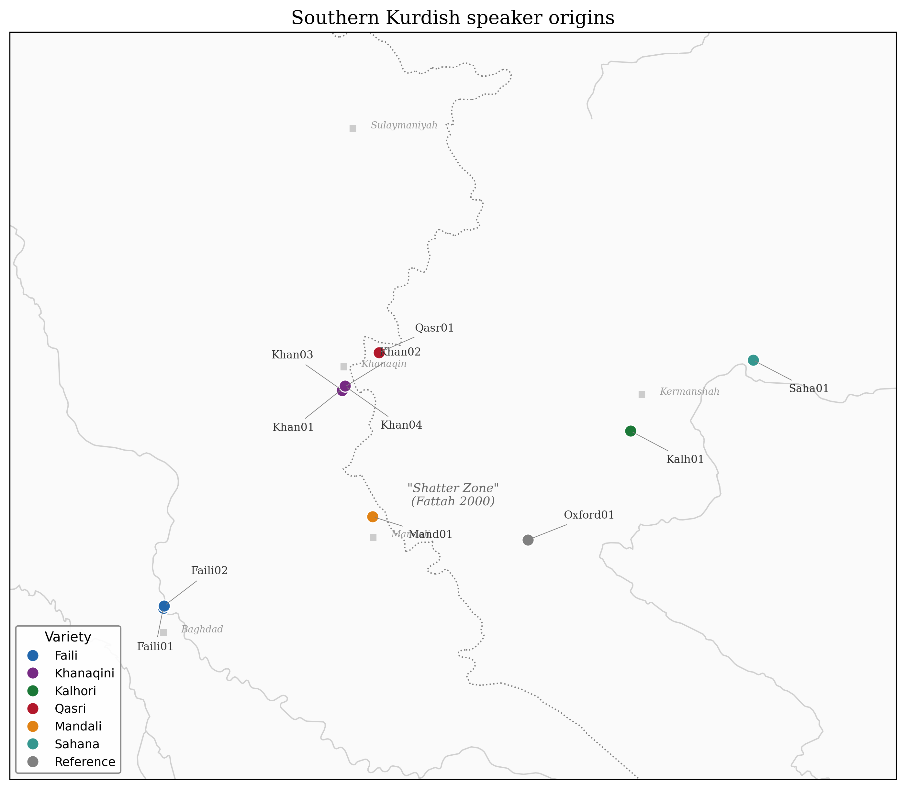

# 1. Introduction

## 1.1 The shatter zone

The central Zagros range runs northwest to southeast along the Iraq-Iran border, dividing the lowland plains of eastern Iraq from the Iranian plateau. Between the ridgelines, narrow valleys and intermontane basins have long sheltered small, relatively isolated speech communities. The provinces of Kermanshah and Ilam on the Iranian side, together with the Diyala governorate and the town of Khanaqin on the Iraqi side, form the core of the Southern Kurdish (SK) speech area. This is rough, partitioned terrain, and the linguistic picture matches the geography.

Fattah (2000: 56) calls this region a "shatter zone" (zone d'eclatement), a term borrowed from historical geography to describe areas where political fragmentation and geographic compartmentalization produce extreme linguistic diversity over short distances. The label is apt. Within the SK area, Kurdish varieties coexist with Arabic, Persian, and Gorani, each exerting contact pressure at different social registers and in different domains. Arabic dominates administrative life on the Iraqi side; Persian does the same in Iran. Gorani, a distinct Northwest Iranian language sometimes misclassified as Kurdish, occupies several enclaves within the same mountain valleys. The result is a multilingual ecology in which borrowing, code-switching, and structural convergence are constant background processes.

Mutual intelligibility among SK varieties does not degrade smoothly with geographic distance. Speakers of Kalhori in Kermanshah province and speakers of Faili in Khanaqin, separated by roughly 200 kilometers, report partial but inconsistent comprehension. The breakdown tracks not just lexical divergence but structural differences in verbal morphology and case marking (Haig 2008: 103). Complicating matters further, large-scale displacement of Faili Kurds from Iraq during the 1970s and 1980s scattered communities across Iran and the broader diaspora, disrupting dialect networks and making fieldwork on certain varieties difficult. Any classification of SK must account for this fractured sociolinguistic reality.

## 1.2 The classification problem

The standard reference point for Kurdish dialectology is MacKenzie's (1961: 142) tripartite division into Northern (Kurmanji), Central (Sorani), and Southern Kurdish, diagnosed primarily by the lenition of intervocalic *-d-* (retained in Northern Kurdish, weakened to a fricative in Central Kurdish, lost entirely in many Southern varieties). This phonological isogloss has proven durable as a first-order classifier. The trouble begins when one looks inside Southern Kurdish and asks what structure, if any, holds among its constituent varieties.

Fattah (2000: 56) documents at least 35 distinct SK varieties and argues that Laki, traditionally grouped with Southern Kurdish, should be removed from the classification on phonological grounds. If Laki is excluded, the remaining varieties still resist neat subgrouping. The specific question that has proved most stubborn is whether Faili, Kalhori, and Khanaqini form a hierarchical subgroup within SK, or whether they radiate from a common ancestor without recoverable internal branching, a flat star topology in phylogenetic terms.

Qualitative methods have not resolved this question because the available isoglosses point in different directions. Phonological features group Faili with Kalhori; morphosyntactic features, particularly patterns of ergativity loss, group Kalhori with Khanaqini (Haig 2008: 103). When different feature classes produce contradictory trees, the traditional method of bundling isoglosses on a map cannot adjudicate between them without an explicit weighting scheme, and no such scheme has been agreed upon. Mohammadirad (forthcoming) goes further, arguing that the SK area is better understood as a "transitional zone" between Central Kurdish and the wider West Iranian continuum described by Paul (1998), raising the question of whether Southern Kurdish is a genetic clade at all or an areal grouping held together by geography and contact.

## 1.3 A Bayesian solution

Bayesian phylogenetic inference offers a way forward precisely because it handles conflicting signal without forcing a single resolution. Rather than producing one best tree, the method samples from a posterior distribution of trees, each weighted by its probability given the data and a specified model of character evolution. Competing topologies, such as the Faili-Kalhori subgroup versus the flat star, receive explicit posterior probabilities that can be compared directly.

The approach has precedent in historical linguistics. Gray and Atkinson (2003: 435) applied Bayesian inference to the Indo-European family using lexical cognate data, and Bouckaert et al. (2012) extended the framework to include geographic diffusion modeling. More recently, Auderset et al. (2023: 35) used similar methods to resolve internal structure within the Mixtecan languages, a family that presents analogous problems of shallow time depth and extensive contact. These studies demonstrate that computational phylogenetics can produce informative results even where the phylogenetic signal is weak or partially obscured by borrowing.

The present study uses BEAST 2 (Bouckaert et al. 2014) with a covarion substitution model, which allows evolutionary rates to vary across both characters and branches. This flexibility is important for dialect-level data, where some lexical items change rapidly under contact pressure while others remain stable. Model comparison relies on Bayes Factors (Kass and Raftery 1995: 773), providing a principled criterion for choosing among alternative tree topologies and substitution models.

## 1.4 Scope and contributions

This thesis is a proof of concept, not a definitive classification of Southern Kurdish. The dataset comprises an 85-item borrowing-resistant wordlist elicited from 11 speakers representing 6 SK varieties (Faili, Kalhori, Khanaqini, Garrusi, Malekshahi, and Luri-e Kuchak [VERIFY]), with Central Kurdish and Gorani included as outgroup comparators. Laki is excluded because no sufficiently detailed published wordlist was available at the time of data collection.

The study addresses three research questions:

1. Does the lexical evidence support a hierarchical internal structure for Southern Kurdish, or is the topology better characterized as an unresolved polytomy?
2. If hierarchical structure exists, which varieties cluster together, and with what posterior probability?
3. How do the results compare with the subgrouping hypotheses proposed by MacKenzie (1961), Fattah (2000), and Mohammadirad (forthcoming)?

The remainder of the thesis is organized as follows. Chapter 2 reviews the linguistic background of the SK area and introduces the theoretical framework for Bayesian phylogenetic inference. Chapter 3 describes the data collection, coding procedures, and model specifications used in the analysis. Chapter 4 presents the results and evaluates them against the research questions. Chapter 5 discusses the implications, limitations, and directions for future work.

---

# Chapter 2: Background

## 2.1 Southern Kurdish Varieties

The varieties collectively labeled "Southern Kurdish" occupy a geographically fragmented territory along the central and southern Zagros mountain range, spanning the Iraqi-Iranian borderlands. On the Iranian side, this territory encompasses the provinces of Kermanshah and Ilam, extending as far south as Dehloran and as far east as Asadabad in Hamadan Province. On the Iraqi side, the speech area covers the districts of Khanaqin, Mandali, and Badra within the Diyala and Wasit governorates (Fattah 2000: VII). Unlike the expansive plateaus characterizing the Kurmanji-speaking regions of Anatolia, the Southern Kurdish domain is defined by a series of parallel ridges and deep, narrow valleys carved by the tributaries of the Sirwan and Karkheh rivers. This rugged terrain acts both as a natural fortress and as a barrier to easy communication, historically isolating communities in individual valleys and producing a degree of dialectal fragmentation unusual even by Kurdish standards. To the east and southeast, the region grades into the territory of the Lurs; to the north, it borders the Sorani-speaking Mokriyan and Ardalan regions, as well as the enduring pockets of Gorani and Hawrami speakers. This position places Southern Kurdish speakers at a critical geographical interface  the meeting point of the Mesopotamian plains and the Iranian plateau.

The systematic study of these varieties begins with MacKenzie (1961), whose *Kurdish Dialect Studies* established the foundational tripartite classification of Kurdish into Northern (Kurmanji), Central (Sorani), and Southern groups. MacKenzie identified the lenition of Old Iranian intervocalic *-d-* (yielding reflexes such as *-l-*, *-y-*, *-w-*, or deletion) as a primary diagnostic isogloss for the Southern group, distinguishing it phonologically from Central Kurdish (MacKenzie 1961: 142). Under this taxonomy, a wide range of heterogeneous dialects  Kalhori, Feyli, Kordali, Laki, and others  were grouped under a single "Southern Kurdish" umbrella on the basis of shared phonological innovations. For decades, this classification served as the standard in Iranian linguistics, positing a unified ancestral origin for these varieties distinct from the Sorani group.

This unitary model was fundamentally challenged by Fattah (2000) in his comprehensive study *Les dialectes kurdes meridionaux*, the product of approximately twenty-five years of fieldwork across the Southern Zagros. Fattah documented no fewer than thirty-five distinct varieties within the region traditionally labeled "Southern Kurdish" (Fattah 2000: 22-40), ranging from the geographically detached Bijari variety in the north to Feyli in the south, and including well-documented groups such as Kermanshahi, Sanjabi, Kalhori, and Ilami alongside less-known varieties like Erkawazi, Mekhasi, and Warmizyar. The sheer number of identified varieties  each with distinguishing phonological, morphological, or lexical features  revealed a level of internal diversity that strained the coherence of MacKenzie's grouping.

Fattah's most consequential argument concerned the status of Laki. He observed that Laki preserved a feature of fundamental typological significance: split ergativity. In Laki, the ergative construction is maintained in past transitive clauses, aligning it with Kurmanji (Northern Kurdish) and distinguishing it sharply from all other Southern Kurdish varieties, which have shifted to a nominative-accusative alignment (Fattah 2000: 55-56). This morphosyntactic criterion led Fattah to propose that Laki cannot be considered a dialect of Southern Kurdish at all, but rather constitutes a separate branch  what has sometimes been termed the "fourth language" of the Kurdish family, alongside Kurmanji, Sorani, and a reduced Southern Kurdish core. The Laki-speaking territory, stretching from Khorramabad to east of Kermanshah and from Holeylan to Harsin (Fattah 2000: 56-57), with enclaves as far as Khorasan and Mazandaran provinces, represents a substantial speech community whose taxonomic placement remains contested.

The question of Laki's position has been further explored by Anonby (2003), who examined the broader Luri-Laki-Kurdish boundary and found that the taxonomic divisions in this region resist clean resolution. The difficulty lies in the fact that Laki shares lexical and phonological features with Southern Kurdish while retaining the morphosyntactic ergativity characteristic of more northern varieties  a combination that defies placement in any single branch of a tree model. Fattah's reclassification left a reduced Southern Kurdish core centered on Kalhori and Feyli, but it simultaneously opened a broader debate about where the boundaries of "Kurdish" itself should be drawn.

Contemporary scholarship has moved toward a more nuanced position. Haig (2008 [p. ?]) notes that structural innovations in the Southern Zagros  such as the widespread loss of ergativity in most Southern Kurdish varieties  conflict with the phonological isoglosses that MacKenzie used to define the group. A feature-based classification thus produces contradictory results depending on whether phonological or morphosyntactic criteria are prioritized. Mohammadirad (forthcoming) extends this observation, arguing that the Southern Zagros functions as a "transitional zone" where Northwestern Iranian traits (typical of Kurdish) and Southwestern Iranian traits (typical of Persian and Lurish) overlap without bundling into neat isogloss packages. In this view, "Southern Kurdish" is less a genetic clade than a label of convenience for a complex contact zone. Belelli (forthcoming), in her work on the verb in Southern Kurdish, and Borjian (2024), in a recent grammatical description of the Kermanshahi dialect, offer additional perspectives on the distinctiveness of specific Southern Kurdish varieties, though the fundamental question remains open: do these dialects descend from a common Southern Kurdish ancestor, or has prolonged contact created the appearance of unity where none exists genealogically?

The extreme dialectal fragmentation of the region  where neighboring valleys may speak significantly different varieties  can be attributed in part to its historical status as a frontier zone. Throughout the early modern period, the Southern Zagros formed the volatile boundary between the Ottoman Empire and the Persian Safavid (and later Qajar) dynasties. Central state control was often weak or intermittent, allowing tribal confederacies  the Kalhor, the Feyli, the Sanjabi, and others  to emerge as the primary sociopolitical units. Dialect boundaries frequently tracked with tribal allegiances rather than mere geography, such that a "dialect" was often the marker of a specific tribal identity. Seasonal transhumance between lowland and highland pastures prevented the stabilization of a single regional standard, while imperial policies of forced resettlement (deportation) of rebellious tribes transplanted speech communities and created a patchwork linguistic map. The result is a region where historical instability, topography, and tribalism have conspired to preserve a rich but fragmented linguistic mosaic.

The situation is further complicated by the historical presence of Gorani in the same geographic space. Gorani served for centuries as a prestige literary and religious language across much of the Southern Zagros, particularly among the Yarsani (Ahl-e Haqq) communities (Mahmoudveysi et al. 2012). The interaction between vernacular Kurdish dialects and this Gorani superstrate introduced varying degrees of lexical and structural borrowing into different Southern Kurdish varieties, creating yet another layer of similarity that is areally rather than genetically motivated. As Haig has cautioned, apparent lexical closeness between Gorani and Southern Kurdish varieties may reflect centuries of geographic co-existence and mutual borrowing rather than deep genealogical affinity (Haig, personal communication, January 2026)  a distinction that purely lexical data cannot resolve on its own.

The contemporary situation adds urgency to the documentation of these varieties. Over the past century, the Southern Kurdish speech area has been subject to profound demographic upheaval. The Iran-Iraq War (1980-1988) devastated the borderlands, displacing entire communities from towns such as Khanaqin, Mandali, and Qasr-e Shirin. The Ba'athist Arabization campaigns of the 1970s and 1980s forcibly relocated Kurdish populations from Diyala Governorate and replaced them with Arab settlers, severing generations-old ties between speech communities and their geographic bases. On the Iranian side, urbanization has drawn speakers from rural valleys into Kermanshah, Ilam, and Tehran, where the prestige of Persian in education, media, and administration accelerates language shift. Younger speakers in urban settings increasingly use Persian as their primary language of daily interaction, reserving Kurdish for intra-family communication or abandoning it altogether. The result is a situation in which the most linguistically conservative speakers  those who preserve the full range of phonological distinctions documented by Fattah  are overwhelmingly elderly, rural, and declining in number. Several of the varieties Fattah catalogued in the 1970s and 1980s may no longer be spoken in their traditional form; others survive only in displaced communities in Baghdad, Erbil, or the European diaspora, where contact with Arabic, Sorani, or the host-country language introduces new layers of convergence. Any empirical study of Southern Kurdish internal structure must therefore contend not only with the historical complexity of the dialect landscape but also with the reality that this landscape is actively eroding.

It is this unresolved state of affairs  a classification built on contradictory evidence, challenged by internal diversity, complicated by tribal fragmentation and imperial displacement, and obscured by layers of contact with Gorani, Arabic, and Persian  that motivates the present study. If traditional qualitative methods have failed to produce consensus on the internal structure of Southern Kurdish, a quantitative approach capable of handling conflicting signals may offer new traction.

## 2.2 The Dialect Continuum Challenge

The difficulty of classifying Southern Kurdish is not unique to Kurdish linguistics. It is a specific instance of a general problem that has occupied historical linguistics since its inception: the inadequacy of discrete models when applied to continuous data.

The dominant metaphor in historical linguistics remains the *Stammbaumtheorie*, or Family Tree Model, formalized by August Schleicher in the mid-nineteenth century. The tree model posits that languages diverge through clean bifurcations: a parent language splits into daughter languages, which then develop independently. Shared innovations between daughter languages are interpreted as evidence of common ancestry, and the resulting tree represents a nested hierarchy of genetic relationships. The model is powerful and intuitive, and it has proven remarkably successful for reconstructing deep genealogical relationships  the Indo-European family tree being the paradigmatic example.

However, the tree model carries a critical assumption: that once a speech community separates, it ceases to share significant innovations with its sister branches. This assumption is routinely violated in dialect geography, where adjacent varieties maintain contact and continue to exchange features long after any putative "split." The result is the dialect continuum  a situation in which transitions between varieties are gradual rather than abrupt, mutual intelligibility decreases with distance, and isoglosses refuse to bundle in the neat patterns that a tree model would predict.

The limitations of the tree were recognized early. In 1872, Johannes Schmidt proposed the *Wellentheorie*, or Wave Theory, which models linguistic change as innovations radiating outward from a center, weakening with distance. The Wave Theory captures a reality that the tree cannot: that features diffuse laterally across established boundaries, creating overlapping distributions that resist hierarchical classification. Applied to the Southern Zagros, the Wave Theory offers a plausible account of why phonological isoglosses and morphosyntactic isoglosses cross-cut one another  they represent different waves of innovation, propagated at different times from different centers, and there is no reason to expect them to align.

Paul (1998) brought this theoretical tension into sharp focus for the West Iranian context. In his analysis of the position of Zazaki among West Iranian languages, Paul demonstrated that the entire West Iranian family  not merely Kurdish  functions as a dialect continuum stretching from Northwestern varieties (Kurdish, Zazaki, Gorani, Tatic) through transitional forms to Southwestern varieties (Persian, Lurish). The isoglosses defining "Northwestern Iranian" as a genetic grouping are often retentions rather than shared innovations: features preserved from Proto-Iranian that were subsequently lost in the Southwest (cf. Korn 2019: 239 [p. ?]). A grouping defined by retentions, Paul argued, is inherently weaker than one defined by exclusive innovations, because retentions can be independently preserved in unrelated lineages. The consequence is that "Northwestern Iranian" may be more a geographic designation than a tight genetic clade  and the same uncertainty propagates downward to its supposed subgroups, including Kurdish.

For Southern Kurdish specifically, the continuum problem is acute. The varieties of the Southern Zagros sit at the intersection of multiple diffusion zones. Arabic vocabulary has penetrated from the west through centuries of Islamic administration (Opengin 2020: 459 [p. ?]); Persian influence radiates from the east through state education, media, and commerce; and Gorani features have diffused through centuries of religious and literary prestige. Each of these contact layers creates a "wave" of similarity that has nothing to do with shared ancestry. The influx of Arabic vocabulary into Kurdish, Persian, and Zazaki creates a superficial layer of similarity across the entire West Iranian spectrum, while the long-standing political and cultural dominance of Persian has led to the progressive "Persianization" of certain Southern Kurdish varieties, particularly in syntax and idiom. These contact phenomena act as noise in the phylogenetic signal: a feature shared by a Southern Kurdish variety and Persian might be misinterpreted as evidence of genetic closeness when in reality it reflects centuries of bilingualism.

The challenge for any classificatory method is therefore to disentangle these layers: to separate (1) genetic retentions inherited from a common ancestor, (2) shared innovations arising from early dialect proximity, and (3) later convergence effects driven by contact with prestige languages. The failure to distinguish these layers leads to the misclassification of contact-induced similarity as genetic kinship  a pitfall that the strict application of the tree model often invites.

Attempts to address the continuum problem computationally have yielded instructive precedents. Heggarty et al. (2023 [p. ?]) applied Bayesian phylogenetic methods to the Quechua family of South America, a case that shares structural parallels with Southern Kurdish: a dialect continuum spread across rugged terrain, with a history of imperial disruption (Inca, then Spanish) and ongoing contact-driven convergence. Their analysis demonstrated that probabilistic tree-building could recover meaningful subgroupings even where traditional isogloss-based methods had produced contradictory classifications, though they also found that the posterior distributions at certain nodes reflected genuine ambiguity in the data rather than methodological failure. Cathcart (2020 [p. ?]), working specifically on West Iranian, applied phylogenetic network methods to a broader set of Iranian languages and confirmed that the Northwestern-Southwestern divide is not a clean bifurcation but a gradient, with Kurdish varieties occupying an intermediate position that reflects both retained archaisms and contact-driven innovations. These studies suggest that computational methods do not dissolve the continuum problem but reframe it: instead of forcing a binary classification, they quantify the degree to which the data supports competing hypotheses and identify the specific loci where conflicting signals are strongest.

Traditional qualitative methods  comparing isoglosses, weighing their relative importance, debating which features are "diagnostic"  have not produced consensus for Southern Kurdish. The disagreements between MacKenzie, Fattah, and the transitional-zone school are not failures of scholarship but symptoms of a fundamental mismatch between the analytical tool (the discrete tree) and the empirical reality (the contact-saturated continuum). What is needed is a method that does not force an either-or choice between tree and wave, but instead quantifies the degree to which the data supports one topology over another  and honestly reports when the signal is ambiguous. This is the promise of Bayesian phylogenetic inference.

## 2.3 Bayesian Phylogenetics

Bayesian phylogenetic methods entered historical linguistics through the landmark study of Gray and Atkinson (2003: 435), which applied computational techniques originally developed for molecular biology to the Indo-European family. By analyzing cognate data across Indo-European languages using Bayesian Markov Chain Monte Carlo (MCMC) algorithms, Gray and Atkinson demonstrated that probabilistic tree-building could recover known subgroupings with high statistical confidence while simultaneously dating divergence events. The study was controversial  its dating estimates were contested by historical linguists who argued the method produced impossibly old dates supporting the Anatolian hypothesis over the Steppe/Kurgan model (Balter 2004; Heggarty 2006), by scholars who demonstrated that forcing linguistic data into bifurcating trees misinterprets contact-induced similarity as shared inheritance (McMahon and McMahon 2005), and most forcefully by Pereltsvaig and Lewis (2015), who argued that the approach amounted to "glottochronology with bells and whistles," privileging mathematical abstraction over archaeological and linguistic evidence. More broadly, critics questioned the transferability of biological models to cultural data, noting that language evolution is heavily reticulate due to borrowing and contact (McMahon and McMahon 2005), that binary cognate coding oversimplifies complex linguistic relationships (Heggarty 2006), that the tree model is fundamentally unsuited for dialect chains and linkage situations (Franois 2014), and that phylogenetic trees model only "spread zones" while failing to capture the long-term equilibrium of accretion zones (Nichols 1992). Despite these critiques, the study established a methodological precedent that has since been extended to language families worldwide, including Austronesian (Gray, Drummond and Greenhill 2009), Semitic (Kitchen et al. 2009), Japonic (Lee and Hasegawa 2011), Bantu (Grollemund et al. 2015), Turkic (Hruschk... [truncated]

The core logic of Bayesian inference differs fundamentally from the deterministic approaches of traditional classification. Where a parsimony analysis seeks the single tree that minimizes the total number of character-state changes, and a maximum likelihood analysis seeks the single tree that maximizes the probability of the observed data, Bayesian inference produces a *posterior distribution*  a probability-weighted sample of thousands of plausible trees (Larget and Simon 1999; Felsenstein 2004: Ch. 18). Each tree in the sample represents a hypothesis about the evolutionary history of the data, and the frequency with which a given relationship appears in the sample provides a direct measure of confidence in that relationship (Huelsenbeck et al. 2001: 2311). Unlike bootstrap support values, which measure sampling consistency, posterior probabilities represent the probability that a given clade is correct given the data and model (Yang 2006: 5.3). A clade appearing in 95% of sampled trees receives a posterior probability of 0.95; one appearing in only 55% is flagged as uncertain, likely reflecting conflicting signals in the data (Felsenstein 2004; Drummond and Bouckaert 2015).

This quantification of uncertainty is precisely what the Southern Kurdish classification problem demands. A traditional analysis must declare a variety either "inside" or "outside" a group; a Bayesian analysis can report that the data supports inclusion with, say, 0.72 probability  an honest representation of ambiguity that is more informative than a forced binary choice.

The inference proceeds through MCMC sampling. The algorithm begins with an initial tree and a set of model parameters  a substitution model governing how character states change over time, a clock model specifying the rate of change, and a tree prior encoding assumptions about the branching process. The algorithm then proposes small modifications  swapping branches, adjusting rates  and accepts or rejects each proposal based on how well the modified tree explains the observed data. Over millions of iterations, the chain converges on the high-probability regions of "tree space," producing a representative sample of the posterior distribution. Convergence is assessed by examining Effective Sample Size (ESS) values for key parameters; ESS values exceeding 200 indicate that the chain has explored the distribution adequately rather than becoming trapped in a local optimum (Drummond and Bouckaert 2015: 128; Rambaut et al. 2018).

The substitution model governs how character states (in this case, cognate presence or absence, coded as binary 1/0) change over evolutionary time. For binary linguistic data, the Binary Continuous-Time Markov Chain (CTMC) model (Lewis 2001; Bouckaert et al. 2012, 2014) estimates the rates at which cognates are gained and lost along the branches of the tree. Gamma-distributed rate heterogeneity (Yang 1994), adapted for linguistic data by Atkinson and Gray (2005), accounts for the empirical observation that some lexical items evolve faster than others  function words and basic body-part terms are notoriously resistant to replacement (Swadesh 1952; Pagel, Atkinson and Meade 2007), while cultural vocabulary turns over rapidly (Tadmor, Haspelmath and Taylor 2010). The tree prior specifies assumptions about the branching process itself; the Yule model (Gernhard 2008), which assumes a constant rate of lineage splitting without extinction, provides a parsimonious baseline appropriate for datasets representing distinct varieties rather than population-level samples (Chang et al. 2015; Bouckaert et al. 2012).

The fundamental limitation of any tree-based method  including Bayesian phylogenetics  is the assumption that evolution is fundamentally bifurcating. Languages do not always split cleanly; they borrow, converge, and hybridize. Bayesian inference does not eliminate this assumption, but it provides tools to detect its violations. When the data contains strong conflicting signals  as would be expected in a contact-saturated continuum  the posterior distribution reflects this conflict: the consensus tree shows low support values at the contested nodes, and visualization tools such as DensiTree display the full cloud of sampled trees, revealing areas of the topology where alternative groupings compete. Complementary network methods, such as Neighbor-Net (Bryant and Moulton 2004: 255), can be employed alongside the Bayesian analysis to explicitly visualize non-tree-like signal, distinguishing areas of clean divergence from areas of reticulation where contact has blurred the genealogical record.

The software ecosystem for Bayesian phylogenetic inference has matured considerably since Gray and Atkinson's original study. BEAST 2 (Bouckaert et al. 2014), the successor to BEAST, has emerged as the standard platform for linguistic phylogenetics due to its modular architecture, which allows researchers to specify substitution models, clock models, and tree priors independently and to compare competing configurations through Bayes factor analysis. Alternative frameworks exist  MrBayes (Ronquist et al. 2012 [p. ?]) remains widely used in biology, and RevBayes (Hohna et al. 2016 [p. ?]) offers a flexible scripting environment  but BEAST 2's extensive use in linguistic studies, from Chang et al. (2015 [p. ?]) on Indo-European to Grollemund et al. (2015 [p. ?]) on Bantu, provides a rich body of methodological precedent and validated parameter settings that can be adapted to new datasets. The choice of BEAST 2 for the present study is motivated by this accumulated expertise and by the availability of linguistic-specific packages, including the binary covarion model that accommodates the rate heterogeneity characteristic of lexical evolution.

It should be noted that the scale of the present study differs substantially from the large comparative projects that have defined the field. Auderset et al. (2023: 35), whose analysis of the Mixtecan family serves as a methodological model for this thesis, sampled over one hundred varieties across a language family with high internal diversity. The present dataset  eleven speakers representing six Southern Kurdish varieties plus comparative taxa  is deliberately narrower in scope. The claims made on the basis of this analysis must be proportionally modest. This thesis does not aim to resolve the prehistory of West Iranian or to produce a definitive classification of Kurdish. It is conceived as a proof of concept: a demonstration that Bayesian phylogenetic methods, applied to carefully curated lexical data from a well-defined geographic zone, can provide new empirical traction on classification questions that qualitative methods have left unresolved. The methodology  from fieldwork through transcription, cognate detection, and probabilistic inference  is designed to be replicable and scalable. If the approach proves viable for the internal structure of Southern Kurdish, it can be extended to the broader Kurdish family and, ultimately, to the West Iranian continuum as a whole.

---

# Chapter 3: Data

## 3.1 Fieldwork Design

The data for this study was collected within what Fattah (2000: 56) terms a linguistic "shatter zone" (*zone d'eclatement*) -- the borderlands of the Southern Zagros spanning from Khanaqin in Iraq through Kermanshah and Ilam in Iran. In this region, Kurdish vernaculars coexist with Arabic and Persian as dominant state languages, producing a linguistic ecology defined by multilingualism, code-switching, and contact-induced change. Standard dialectological methods, which often rely on formal elicitation in institutional settings, risk triggering exactly the kind of register shift that obscures the vernacular baseline. Labov's (1972) Observer's Paradox is particularly acute in communities with a history of linguistic suppression, where formal interview contexts prime the use of prestige varieties -- Standard Sorani, Arabic, or Persian -- rather than the local Southern Kurdish form.

To mitigate this effect, recordings were conducted in settings designed to put speakers at ease rather than in formal institutional environments. The majority of Iraqi-based sessions took place in a monastery library in Sulaymaniyah, a semi-private space familiar to the local community, while the Sahana speaker (Saha01) was recorded in a purpose-built studio with soft furnishings and wooden panelling that minimized both acoustic interference and the formality of the setting. The Kalhori speaker (Kalh01), recorded in Germany, was interviewed at his dining table in Moers -- a domestic setting that reproduced the informal conditions of the Iraqi fieldwork. Equipment consisted of a Rode Wireless Go II microphone system paired with a Rode VideoMic Pro+ mounted directly on a Sony A7S III camera. All sessions were recorded in 4K at 60 frames per second, a deliberate choice that enabled frame-by-frame analysis of lip rounding, tongue position, and jaw movement during post-processing, providing visual corroboration for ambiguous segments in the audio signal. While the informal settings occasionally introduced ambient noise, this was treated as an acceptable trade-off: acoustic noise can be cleaned in post-processing, whereas the sociolinguistic distortion of a formal register, once recorded, cannot be removed.

The fieldwork was conducted across multiple recording sessions between April 2023 and May 2025, with the Iraqi sessions distributed across three fieldwork periods (April 2023, November 2023, and April-May 2025) and the German session (Kalh01) conducted in May 2025.

To ensure semantic comparability across the diverse speaker group, data was elicited using a translation task. The language of elicitation varied by speaker and translator: Arabic (for Khan01, mediated by her son), Sorani (for Qasr01 and others via the primary translator), Khanaqini (for Khan03), and English (for Kalh01 in Germany). Speakers received prompts and carrier sentences, supplemented by physical gestures, pointing, and direct questions such as "what is this called?" The primary translator, Zaem, was particularly effective in Khanaqini elicitation sessions, where his ability to explain and clarify target meanings in the speakers' own variety reduced misunderstandings and minimized reliance on contact-language mediation. While translation tasks carry a risk of lexical priming, this method was necessary to secure the specific items required for phylogenetic analysis, which spontaneous speech often fails to produce in sufficient density. Crucially, prompts never contained the target word in Southern Kurdish, so speakers were not primed with the form being elicited. When an informant provided a word that appeared to reflect a misunderstanding, Zaem would embed the target meaning in a carrier sentence in another language or rephrase the question until the intended concept was clear. Each speaker repeated every lexical item three times during elicitation. The second repetition was preferred as the primary datum, on the grounds that the first repetition often reflects an initial search process -- hesitation, self-correction, or code-switching into the prompt language -- while the third may introduce hyper-articulation or fatigue effects. In cases where the second repetition was degraded by noise or disfluency, the first repetition was substituted.

Informed consent was obtained verbally from all participants, a deliberate choice given the political sensitivity of the region and the history of displacement affecting communities such as the Faili Kurds. Speakers understood that all data would be used strictly for linguistic analysis and that their identities would be anonymized in the resulting publications. For video recordings, participants were informed that only the lower portion of the face (mouth and nose downward) could be made publicly available if there were reason to do so, ensuring that speakers remained visually unidentifiable.

*Figure 1: Geographic origins of the eleven speakers in the dataset, color-coded by variety. The dotted line marks the Iraq-Iran border. Reference cities are shown in gray.*

## 3.2 Speaker Cohort

The primary dataset comprises recordings from eleven native speakers representing six distinct varieties of Southern Kurdish. The cohort was stratified to capture the geographic and social breadth of the shatter zone. The Faili group (Fail01, Fail02) represents the Baghdad diaspora -- an urbanized community defined by the forced deportations of the 1980s, whose speech reflects complex contact between Iraqi Arabic, Persian, and the Kurdish vernacular. The Khanaqin group (Khan01 through Khan04) provides the largest sub-sample from a single location, enabling internal comparison between idiolectal variation and communal norms within the Khanaqini variety. The Iranian group includes a Kalhori speaker (Kalh01) from Klaw Drizh, a village approximately forty kilometres south of Kermanshah, a Qasri speaker (Qasr01) from Qasr-e Shirin, and a Sahana speaker (Saha01) from the town of Sahana -- varieties self-identified by speakers as "Kalhori," "Qasri," and "Sahane" (or "Kurdi Xwareen") respectively. Mandali (Mand01), born in Khanaqin but representing the Mandali variety, occupies a transitional position on the Arab-Kurdish linguistic border. A reference dataset (Oxfo01), provided by Masoud Mohammadirad (University of Cambridge), aligns the fieldwork data with the varieties documented in the forthcoming Oxford Handbook of Kurdish Linguistics (Haig et al., forthcoming).

The demographic composition of the cohort spans an age range of approximately 26 to 64 years and includes five women and six men. This cross-generational and cross-gender spread is methodologically significant. In the Kurdish context, gendered access to education and the public sphere often produces different rates of contact-induced change: male speakers, historically more integrated into the state economy, tend to show higher rates of Persian and Arabic lexical borrowing, while female speakers -- particularly in older generations -- often preserve conservative phonological features that have been leveled in male speech.

Fail01 (male, born 1984) spent six years in Baghdad before moving to Tehran (seven years) and Ilam (five years), settling in Sulaymaniyah around 2002, and is multilingual in Faili, Arabic, Farsi, Kalhori, and English. Fail02 (female, born 1968) lived twelve years in Baghdad and twenty-four years in Tehran before relocating to Sulaymaniyah in 2019. Kalh01 (male, born 1981) grew up in Klaw Drizh for twenty-five years before periods in Tehran (four years) and southern Iran (one year), and has lived in Germany since 2016; he speaks Kalhori, Farsi, English, Sorani, and German, and understands Kurmanji and formal Arabic. He holds an MA in General Linguistics with a thesis on Kalhori phonology based on data he collected in his home region, making him both an informant and a linguistically trained observer of his own variety. Khan01 (female, born 1970) lived in Baghdad from birth until 2006 before relocating to Sulaymaniyah; her son Muhamed served as translator across two sessions (27 and 28 April 2023), speaking Arabic to her during elicitation. Khan02 (female, born 1967) spent twenty-five years in Khanaqin and sixteen in Baghdad before moving to Sulaymaniyah, holds a BA in Kurdish language from Baghdad, and speaks Germiani alongside Khanaqini, Arabic, and some Turkish. Khan03 (male, born 1978) spent ten years in Baghdad and five in Khanaqin before settling in the Sulaymaniyah-Khanaqin area in 2003; his variety is identified as Kalhori-Khanaqini, and he speaks Arabic and Farsi as second languages. Khan04 (female, born circa 2000 in Khanaqin) represents the youngest generation and had recently moved to Sulaymaniyah for the first time; notably, her mother speaks Lori and her father is from Sulaymaniyah, introducing potential contact variables that must be considered when interpreting her data. Qasr01 (male, born 1973) from Qasr-e Shirin lived in Kermanshah (sixteen years) and Karaj-Tehran (sixteen years) before crossing into Iraq, where he has lived in Sulaymaniyah for appro... [truncated]

Six of the eleven speakers have lived in non-Kurdish-majority cities (Baghdad, Tehran, Karaj), and three have migrated between Iraq and Iran. This pattern of displacement and multilingualism is not an anomaly to be controlled away but the defining sociolinguistic reality of the Southern Kurdish shatter zone -- a reality that any analysis of this region must confront rather than exclude.

The majority of fieldwork sessions were mediated by Zaem, a male Germiyani-Khanaqini bilingual from Sulaymaniyah (born circa 2000) who speaks Germiyani (L1), Khanaqini, Arabic, and English, and visits family in Khanaqin regularly. His familiarity with both the Khanaqini variety and the local community networks was instrumental in establishing the rapport necessary for naturalistic elicitation. The Sahana session was mediated by Perya, a professional legal translator who used both Sorani and Farsi during elicitation and English with the researcher. The variation in elicitation languages across sessions -- Arabic, Sorani, Khanaqini, and English -- is a potential confound that must be acknowledged: different prompt languages may activate different lexical access pathways, potentially influencing which variant of a target item a speaker produces. This risk was mitigated by the bilingual check protocol described above.

## 3.3 The Lexical Dataset

The construction of a phylogenetically informative wordlist in a contact-saturated zone requires a principled approach to distinguishing genealogical signal from areal noise. The theoretical framework for this distinction is provided by the Loanword Typology Project (Haspelmath and Tadmor 2009), which demonstrates that lexical borrowing is not stochastic but governed by predictable semantic constraints. "Cultural" vocabulary -- terms relating to religion, law, administration, and technology -- is highly susceptible to replacement under conditions of superstratal influence, while "basic" vocabulary -- body parts, motion verbs, fundamental physical properties -- demonstrates remarkable cross-linguistic stability (Haspelmath and Tadmor 2009: 22-34; Tadmor, Haspelmath and Taylor 2010).

The stability hierarchy documented by Haspelmath and Tadmor is not merely an empirical generalization but reflects deep functional constraints on lexical replacement. Body-part terms, for instance, are acquired early in language development, used with high frequency, and embedded in dense collocational networks that resist item-by-item substitution; a language can borrow the word for "telephone" without disrupting its lexicon, but borrowing the word for "hand" requires restructuring dozens of idiomatic expressions, compounds, and metaphorical extensions. Conversely, cultural vocabulary sits at the periphery of the lexical system, loosely connected and easily replaced when a new prestige source provides an alternative. The practical consequence is that a wordlist designed for phylogenetic inference must be weighted toward the stable core, even at the cost of excluding semantically rich but borrowing-prone domains.

For the Southern Kurdish shatter zone, where centuries of contact with Arabic (as the language of religion and historical administration) and Persian (as the language of state and high culture) have saturated the cultural lexicon, a naive wordlist would be methodologically disastrous. A standard list containing terms such as *judge* (*hakim*), *religion* (*din*), or *court* (*mahkama*) would cluster varieties based on their political and religious contact history rather than their linguistic genealogy. The primary imperative was therefore to construct a dataset that maximizes resistance to borrowing.

The resulting wordlist consists of eighty-five items, derived from the intersection of two comparative corpora: the Jena-Bamberg Iranian List (JBIL) combined with the Kurdish Lexical Questionnaire (KLQ), which together comprise roughly 500 lexical items developed by Haig and Anonby for fieldwork across the Iranian language family, and the wordlist used in the Oxford Handbook of Kurdish Linguistics (Haig et al., forthcoming), which comprises 125 items based on a modified Swadesh list supplemented with Kurdish-diagnostic terms. The decision to narrow the dataset to items overlapping with the Oxford Handbook wordlist was deliberate: by aligning with a pre-existing, independently compiled list, the present study produces results that are directly comparable to the Oxford Handbook corpus and provides a foundation on which future phylogenetic analyses can expand. Rather than imputing missing data or tolerating gaps, the analysis was restricted to items attested with high quality across all surveyed varieties -- a "lowest common denominator" approach that sacrifices breadth for reliability.

The semantic composition of the eighty-five items is heavily weighted toward domains that the Loanword Typology Project identifies as the most resistant to replacement: basic verbs (25.9%), including items such as *eat*, *drink*, *die*, *kill*, *sleep*, and *give*; body parts (23.5%), including *head*, *eye*, *hand*, *liver*, *heart*, and *blood*; natural phenomena (23.5%), including *water*, *fire*, *sun*, *star*, and *stone*; and core adjectives and properties (18.8%), including *big*, *small*, *long*, and *new*. Function words and kinship terms account for the remainder. Crucially, all items susceptible to borrowing from the Islamic-administrative sphere were excluded.

To validate the quality of this intersection, the list was benchmarked against the Leipzig-Jakarta List (Haspelmath and Tadmor 2009), an empirically derived inventory of the one hundred meanings most resistant to borrowing cross-linguistically. The overlap stands at 92% (seventy-eight of eighty-five items), confirming that the data-driven intersection converged on the most stable portion of the lexicon. While eighty-five items is a smaller dataset than some macro-family studies, Gray and Atkinson (2003) demonstrated that accurate, borrowing-resistant lists produce more reliable trees than larger, noisier ones. The dataset represents the "hard core" of the Southern Kurdish lexicon -- the stratum most likely to preserve genuine genealogical signal beneath the layers of contact.

A further consideration in wordlist design concerns the treatment of compound numerals, which present a specific methodological challenge. Languages frequently express teen numbers (eleven through nineteen) as transparent compounds of a base and a unit -- "ten-three" for thirteen, for instance. When two varieties share the compound structure but differ in one component, coding the compound as a single unit conflates independent etymological judgments. Following the recommendation of Bouckaert et al. (2014 [p. ?]), compound numerals were decomposed into their constituent morphemes, each coded independently. Where decomposition proved ambiguous -- as with lexicalized compounds whose internal structure is no longer transparent to speakers -- the item was excluded rather than force-fitted into a coding scheme. This conservative treatment reflects a broader principle governing the entire dataset: uncertainty is flagged and excluded rather than resolved by assumption.

The decision to work with eighty-five items rather than a larger inventory also reflects the practical constraints of fieldwork in a conflict-affected region. Not all speakers could be recorded under identical conditions; some sessions were interrupted, others conducted in noisy environments that degraded specific items. Rather than retaining items with uneven attestation and introducing systematic gaps into the character matrix, the wordlist was trimmed to the intersection of high-quality attestations across all eleven speakers. The resulting dataset is small by the standards of large-scale phylogenetic studies -- Auderset et al. (2023: 35) used 209 concepts across 137 varieties -- but it is complete. Every cell in the character matrix contains a verified datum, eliminating the need for imputation or missing-data handling that can introduce artifacts into Bayesian inference.

---

# Thesis Outline

**Working Title:** Quantifying Dialect Divergence in Southern Kurdish: A Bayesian Phylogenetic Approach

**Student:** Lucas Ardelean
**Supervisor:** Prof. Geoffrey Haig (Uni Bamberg)
**External Reviewer:** Sarah Babinski (UZH, Bayesian specialist)
**Deadline:** End of May 2026

## Structure (Following Auderset et al. 2023 Mixtecan Model)

### 1. Introduction
- **1.1 The Shatter Zone:** Concrete geography (Zagros ridges, Kermanshah, Ilam, Diyala); Fattah's "shatter zone" (2000: 56); multilingual ecology; intelligibility breakdown; Faili displacement.
- **1.2 The Classification Problem:** MacKenzie's tripartite division (1961: 142); Fattah's 35 varieties and Laki removal; flat star vs. hierarchical tree for Faili/Kalhori/Khanaqini; contradictory isoglosses; Mohammadirad's "transitional zone" argument.
- **1.3 A Bayesian Solution:** Posterior distributions handle ambiguity; Gray & Atkinson 2003, Bouckaert et al. 2012; BEAST 2 + Covarion; Bayes Factors.
- **1.4 Scope & Contributions:** Proof of concept; Laki excluded; 11 speakers, 85 items, 6 varieties; 3 research questions; chapter roadmap.

### 2. Background
- **2.1 Southern Kurdish Varieties:** Geographic distribution; MacKenzie (1961); Fattah (2000) and 35 varieties; Laki controversy; Gorani superstrate; contemporary displacement and language shift.
- **2.2 The Dialect Continuum Challenge:** Stammbaumtheorie vs. Wellentheorie; Paul (1998) on West Iranian continuum; contact layers (Arabic, Persian, Gorani); computational precedents (Heggarty et al. 2023, Cathcart 2020).
- **2.3 Bayesian Phylogenetics:** Gray & Atkinson (2003) and critics; extensions to other families; posterior distributions; clade support; ESS threshold; CTMC model; Gamma rates; lexical stability; Yule prior; BEAST 2 ecosystem; proof-of-concept framing.

### 3. Data
- **3.1 Fieldwork Design:** Shatter zone context; Observer's Paradox mitigation; recording settings; equipment (Rode Wireless Go II + VideoMic Pro+ on Sony A7S III, 4K/60fps); elicitation via carrier sentences, gestures, pointing; translators; verbal informed consent + video face-cropping policy.
- **3.2 Speaker Cohort:** 11 speakers, 6 varieties; demographic composition; detailed profiles; displacement as defining sociolinguistic reality.
- **3.3 The Lexical Dataset:** Borrowability theory (Haspelmath & Tadmor 2009); JBIL + KLQ (~500 items combined) intersected with Oxford Handbook wordlist; 85-item borrowing-resistant core; Leipzig-Jakarta validation (92% overlap); compound numeral treatment.

### 4. Methodology
- **4.1 Transcription:** Human-primary IPA transcription for SK vowels; Wav2Vec2 ASR validation.
- **4.2 Cognate Detection:** LingPy LexStat (threshold 0.55-0.65); manual correction guided by MacKenzie (1961) phonology.
- **4.3 Phylogenetic Inference:** BEAST 2; Binary Covarion (primary) + Binary CTMC+Gamma (sensitivity); Strict Clock; Yule Prior; agnostic rooting; MCMC parameters.

### 5. Results
- **5.1** Cognate clustering outcomes.
- **5.2** Phylogenetic trees (MCC tree, posterior support).
- **5.3** DensiTree visualization.
- **5.4** Bayes Factors (testing specific topological hypotheses).

### 6. Discussion
- **6.1** Clade vs. gradient: does the data support discrete SK subgroups?
- **6.2** The position of outliers (Mandali, Qasri).
- **6.3** Methodological validity: did the hybrid LingPy approach work?
- **6.4** Limitations (sample size, ASR noise).

### 7. Conclusion
- **7.1** Summary of findings.
- **7.2** Proof of concept established.
- **7.3** Future work (scaling to full West Iranian family).

### Open Flags
- Bouckaert et al. (2014) page number for compound numeral recommendation (Ch3)
- Ronquist et al. (2012), Hohna et al. (2016), Chang et al. (2015), Grollemund et al. (2015) page numbers in Ch2.3
- Haig (2008), Heggarty et al. (2023), Cathcart (2020), Korn (2019), Opengin (2020) page numbers in Ch2.1-2.2

---

## Timeline (February - May 2026)

| Week | Phase | Key Tasks |
| :--- | :--- | :--- |
| Feb 03-09 | Foundation | Draft Intro, Data Overview, Profiles; Zotero Sync |
| Feb 10-16 | Foundation | Ch2 Background drafted; Ch3 rewritten; Workflow locked |
| Feb 17-23 | Analysis | Finalize LingPy thresholds; Nexus conversion; Expand Ch3 + Ch4 |
| Feb 24-Mar 01 | Analysis | BEAST 2: Run pilot chains; Check convergence |
| Mar 02-Mar 15 | Analysis | Adjust models; Run final chains |
| Mar 16-Apr 12 | Drafting | Draft Results and Discussion; Merge chapters |
| Apr 13-Apr 26 | Review | Supervisor feedback (Haig/Babinski) |
| Apr 27-May 17 | Polishing | Revisions; LaTeX formatting; Bibliography audit |
| May 18-May 24 | Submission | Final hand-in |
